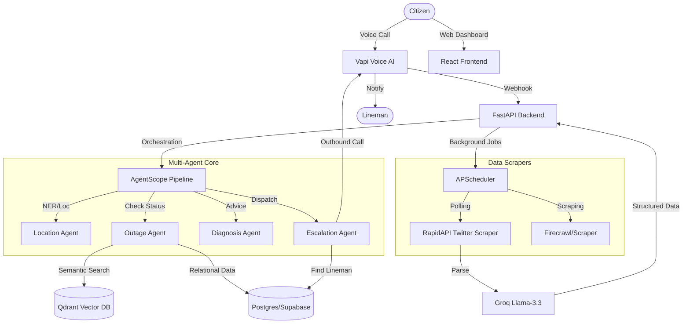

# VidyutSeva: Revolutionizing Power Grid Management with AI Agents

VidyutSeva is a sophisticated, citizen-centric platform designed to solve the notification and transparency gap during electricity outages in Bangalore. By replacing static IVR systems with Voice-AI agents and real-time social signal ingestion, VidyutSeva provides citizens with instant, accurate, and localized outage information.

---

## Key Features

*   **Live Outage Ecosystem**: An interactive map dashboard providing a unified view of official BESCOM reports and crowdsourced Twitter signals.
*   **AI Voice Interface**: Integrated with Vapi, providing a LLM-driven voice experience for citizens to report issues and receive status updates in natural language.
*   **Multi-Agent Orchestration**: Powered by AgentScope, featuring a specialized pipeline of ReAct agents:
    *   **Location Agent**: Precise extraction of neighborhoods and landmarks from unstructured speech/text.
    *   **Outage Agent**: Semantic and relational lookup across official records and historical logs.
    *   **Diagnosis Agent**: Generates actionable advice and estimated restoration times.
    *   **Escalation Agent**: Detects hardware faults (transformers, cables) and automatically dispatches the nearest lineman via outbound Vapi calls.
*   **Real-time Ingestion**:
    *   **BESCOM Scraper**: Automated extraction of planned maintenance data via Firecrawl.
    *   **Twitter/X Sentinel**: Real-time monitoring of citizen complaints using RapidAPI and Groq-powered LLM parsing.
*   **Smart Crowd-Detection**: Algorithmically identifies emerging outages by clustering semantic reports; 3+ verified reports in an area within 30 minutes triggers an automatic system alert.

---

## System Architecture



---

## Tech Stack

### Backend
*   **Framework**: FastAPI (Python 3.12+)
*   **Dependency Management**: uv
*   **AI/LLM**: AgentScope, LangGraph, Groq (Llama 3.3), Google Gemini
*   **Database**: Supabase (Postgres), Qdrant (Vector DB)
*   **Ingestion**: Firecrawl, RapidAPI (Twitter 241/Search)
*   **Voice**: Vapi (Interactive Voice AI)

### Frontend
*   **Framework**: React (Vite)
*   **Mapping**: Leaflet / React-Leaflet
*   **Styling**: Vanilla CSS (Premium Dark Theme)

---

## Project Structure

```text
├── backend/
│   ├── agents/          # AgentScope (Location, Outage, Diagnosis, Escalation)
│   ├── database/        # Supabase client & DB management
│   ├── qdrant/          # Vector embeddings & semantic search logic
│   ├── scraper/         # Twitter and BESCOM web scrapers
│   ├── voice/           # Vapi webhook handlers
│   └── main.py          # FastAPI entry point & background scheduler
├── frontend/
│   ├── src/
│   │   ├── components/  # LiveHeatmap, VapiWidget, and UI elements
│   │   └── api/         # Frontend API clients
│   └── index.css        # Core design system
└── .gitignore           # Excludes agent metadata and environment secrets
```

---

## Getting Started

### Backend Setup
1.  Navigate to the backend directory:
    ```bash
    cd backend
    ```
2.  Install dependencies using `uv`:
    ```bash
    uv sync
    ```
3.  Configure environment variables (see `.env`).
4.  Run the server:
    ```bash
    uvicorn main:app --reload
    ```

### Frontend Setup
1.  Navigate to the frontend directory:
    ```bash
    cd frontend
    ```
2.  Install dependencies:
    ```bash
    npm install
    ```
3.  Start the development server:
    ```bash
    npm run dev
    ```

---

## Environment Variables

The project requires several API keys to function fully. Copy relevant environment variables to your `.env` files:

*   **Database**: `SUPABASE_URL`, `SUPABASE_KEY`, `DATABASE_URL`.
*   **AI/LLM**: `GEMINI_API_KEY`, `GROQ_API_KEY`.
*   **Vector DB**: `QDRANT_URL`, `QDRANT_API_KEY`.
*   **Voice (Vapi)**: `VAPI_API_KEY`, `VITE_VAPI_ASSISTANT_ID`, `VITE_VAPI_PUBLIC_KEY`, `VAPI_PHONE_NUMBER_ID`, `VAPI_LINEMAN_ASSISTANT_ID`.
*   **Scraping**: `RAPIDAPI_KEY`, `FIRECRAWL_API_KEY`.

---

## Why Vapi and Qdrant?

### Vapi: The Voice of VidyutSeva
*   **How we used it**: Vapi serves as our conversational interface layer, managing the complex telephony, Speech-to-Text (STT), and Text-to-Speech (TTS) pipeline. It connects our citizen-facing helpline and our automated lineman dispatch system directly to our Agentic Core via low-latency webhooks.
*   **Why we used it**: Traditional IVR systems are rigid and time-consuming. Vapi allows for instantaneous, natural language interactions, ensuring that even under-stress citizens can report issues hands-free, while linemen receive high-context voice briefings for urgent hardware faults.

### Qdrant: The Semantic Memory
*   **How we used it**: Qdrant is our high-performance vector database. We use it to store and query embeddings of every citizen call transcript, historical BESCOM outage record, and crowd-sourced social signal.
*   **Why we used it**: Standard relational databases struggle with the nuances of human language. Qdrant enables **Semantic Search (RAG)**, allowing our agents to correlate fragmented reports (e.g., "cables are sparking" and "wire fell down") to identify localized hardware failures that might have otherwise been missed by traditional keyword-based systems.

---

## License
Proprietary. Developed for Bangalore Citizen Support.
