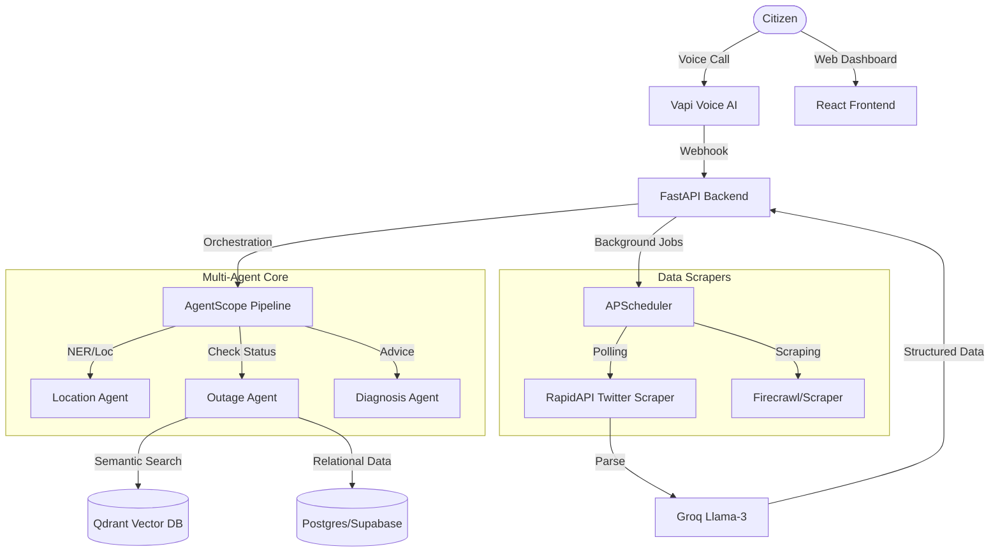

# VidyutSeva: AI-Powered Power Outage Companion

**VidyutSeva** is a sophisticated, citizen-centric platform designed to solve the notification and transparency gap during electricity outages in Bangalore. By replacing static IVR systems with **Voice-AI agents** and real-time **social signal ingestion**, VidyutSeva provides citizens with instant, accurate, and localized outage information.

---

## Key Features

*   **Live Outage Ecosystem**: An interactive map dashboard providing a unified view of official BESCOM reports and crowdsourced Twitter signals.
*   **AI Voice interface**: Integrated with **Vapi**, providing a LLM-driven voice experience for citizens to report issues and receive status updates in natural language.
*   **Multi-Agent Orchestration**: Powered by **AgentScope**, featuring a specialized pipeline of ReAct agents:
    *   **Location Agent**: Precise extraction of neighborhoods and landmarks from unstructured speech/text.
    *   **Outage Agent**: semantic and relational lookup across official records and historical logs.
    *   **Diagnosis Agent**: Generates actionable advice and estimated restoration times.
*   **Real-time Ingestion**:
    *   **BESCOM Scraper**: Automated extraction of planned maintenance data via Firecrawl.
    *   **Twitter/X Sentinel**: Real-time monitoring of citizen complaints using RapidAPI and Groq-powered LLM parsing.
*   **Smart Crowd-Detection**: Algorithmically identifies emerging outages by clustering semantic reports; 3+ verified reports in an area within 30 minutes triggers an automatic system alert.

---

##  System Architecture



---

##  Tech Stack

### Backend
*   **Framework**: FastAPI (Python 3.12+)
*   **Dependency Management**: `uv`
*   **AI/LLM**: AgentScope, LangGraph, Groq (Llama 3.3), Google Gemini
*   **Database**: Supabase (Postgres), Qdrant (Vector DB)
*   **Ingestion**: Firecrawl, RapidAPI (Twitter 241/Search)
*   **Voice**: Vapi (Interactive Voice AI)

### Frontend
*   **Framework**: React (Vite)
*   **Mapping**: Leaflet / React-Leaflet
*   **Styling**: Vanilla CSS (Premium Dark Theme)

---

##  Project Structure

```text
├── backend/
│   ├── agents/          # AgentScope implementation (Location, Outage, Diagnosis)
│   ├── database/        # Supabase client & DB management
│   ├── qdrant/          # Vector embeddings & semantic search logic
│   ├── scraper/         # Twitter and BESCOM web scrapers
│   ├── voice/           # Vapi webhook handlers
│   └── main.py          # FastAPI entry point & background scheduler
├── frontend/
│   ├── src/
│   │   ├── components/  # LiveHeatmap and UI elements
│   │   └── api/         # Frontend API clients
│   └── index.css        # Core design system
└── .gitignore           # Excludes agent metadata and environment secrets
```

---

##  Getting Started

### Backend Setup
1.  Navigate to the backend directory:
    ```bash
    cd backend
    ```
2.  Install dependencies using `uv`:
    ```bash
    uv sync
    ```
3.  Configure environment variables (see `.env.example`).
4.  Run the server:
    ```bash
    uvicorn main:app --reload
    ```

### Frontend Setup
1.  Navigate to the frontend directory:
    ```bash
    cd frontend
    ```
2.  Install dependencies:
    ```bash
    npm install
    ```
3.  Start the development server:
    ```bash
    npm run dev
    ```

---

## Environment Variables

The project requires several API keys to function fully. Copy `backend/.env.example` to `backend/.env` and provide:

*   `SUPABASE_URL` / `SUPABASE_KEY`: Database hosting.
*   `QDRANT_URL` / `QDRANT_API_KEY`: Vector search for semantic reports.
*   `GROQ_API_KEY`: Used for ultra-fast tweet parsing and agent inference.
*   `VAPI_API_KEY`: Required for voice agent integration.
*   `RAPIDAPI_KEY`: Required for Twitter scraping.
*   `FIRECRAWL_API_KEY`: Required for official BESCOM web scraping.

---

##  License
Proprietary. Developed for Bangalore Citizen Support.
